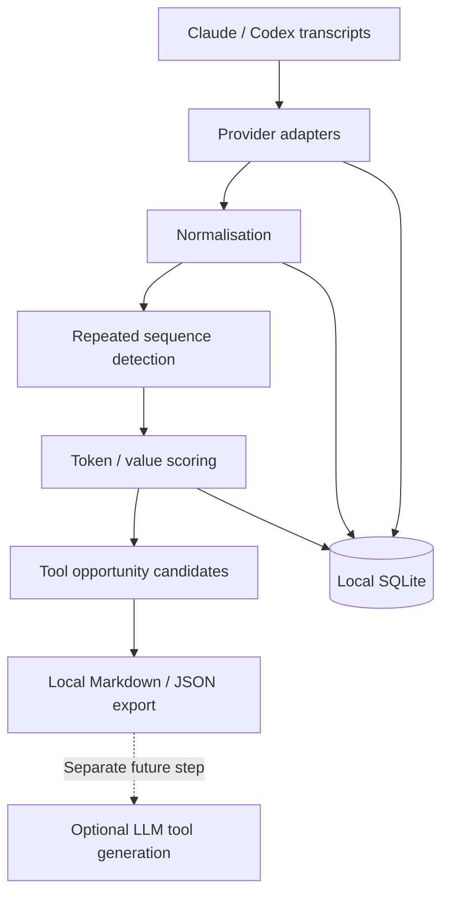

# Transcript Tool Miner

Find repeated agent workflows in Claude Code and Codex transcripts and surface opportunities to replace token-heavy reasoning chains with deterministic tools.

Transcript Tool Miner (`ttm`) is a local Python CLI. It parses transcript files, normalises tool calls, mines repeated action sequences, and ranks tool opportunities by estimated avoidable intermediate tokens. **It makes no model calls, executes no transcript commands, and does not create or install tools.**

An agent may repeatedly run a diff, locate tests, interpret output and choose the next command. A deterministic `validate_changed_files()` tool could do that work internally and return a compact result. The opportunity is to avoid repeated model turns and large intermediate outputs, while preserving the decisions that actually need a model.

## Quick start

Requires Python 3.10 or newer and Git. There are no runtime dependencies. Installation may download the Python build tool; analysis itself needs no network.

```sh
git clone https://github.com/matthewcosier/transcript-tool-miner.git
cd transcript-tool-miner
python3 -m venv .venv
. .venv/bin/activate
python -m pip install -e .

# Try the invented fixtures first. These contain no real transcript data.
ttm scan tests/fixtures
ttm analyse
ttm candidates
```

The fixtures contain four sessions across two invented projects, with this shared workflow:

```text
git_diff → find_related_files → run_tests
```

They produce a `validate_changed_files` candidate with four occurrences. Copy its ID from `ttm candidates`:

```sh
ttm candidate show <id>
ttm candidate export <id> --format json --output exports/candidate.json
ttm candidate export <id> --output exports/candidate.md
```

Exports refuse to overwrite existing files. The default database is `.ttm/miner.sqlite3` in the current directory. Use a different database when switching from the demo to real history:

```sh
ttm scan --claude --db .ttm/real.sqlite3
ttm scan --codex --db .ttm/real.sqlite3
ttm analyse --db .ttm/real.sqlite3
ttm candidates --db .ttm/real.sqlite3
```

## CLI

```sh
ttm scan                        # Discover both providers' standard local directories
ttm scan --claude                # Claude projects and prompt history
ttm scan --codex                 # Codex sessions, archived_sessions and prompt history
ttm scan /path/to/transcripts    # Explicit files/directories; no home discovery
ttm scan /path/to/a.jsonl /path/to/b.jsonl
ttm scan /path/to/transcripts --source codex  # Force an adapter when needed
ttm scan /path/to/transcripts --matchers matchers.json --json
ttm analyse                     # Default lengths 2..10, >=2 occurrences in >=2 sessions
ttm analyse --min-length 3 --max-length 6 --min-occurrences 3
ttm analyse --min-sessions 1     # Also allow workflows repeated in a single session
ttm analyse --result-budget 300 --keep-nested
ttm candidates --limit 10
ttm candidates --json
ttm candidate show <id> --format json
ttm candidate export <id> --format json -o exports/candidate.json
```

`--db` works before or after the subcommand; `TTM_DB` sets its default. `CLAUDE_CONFIG_DIR` and `CODEX_HOME` override source roots. `--claude` and `--codex` control automatic discovery only; explicit paths always override discovery. Adapters are detected per file unless `--source` is specified. `analyse` also accepts the spelling `analyze`.

## Architecture



- **Adapters** produce provider-independent sessions and actions, retaining original tool names, arguments, commands, source line numbers, request boundaries, visible output sizes and outcomes.
- **Normalisation** uses deterministic command patterns for Git inspection, searches, file reads, tests, builds and linting. Different revisions and filenames map to the same action. Direct Read/Glob/Grep tools are recognised too.
- **Mining** finds exact contiguous sequences of 2 to 10 normalised actions. Commentary and tool results do not interrupt a sequence. Unknown tool calls and new user requests do. Occurrences of the same candidate cannot overlap in a session.
- **Grouping** removes a shorter candidate when a longer one covers exactly the same occurrences. Short workflows with additional occurrences survive. IDs are stable hashes of the action sequence.
- **SQLite** stores sessions and source fingerprints, raw/normalised action records, patterns with score components, and occurrence spans. Tool output and reasoning bodies are measured but not persisted.

### Supported transcript sources

| Source | Supported records |
| --- | --- |
| Claude Code project JSONL | `assistant` messages with `tool_use`; `user` messages with linked `tool_result`; `sessionId`, `cwd`, visible text/thinking |
| Codex rollout JSONL | `session_meta`, `turn_context`, `event_msg` user boundaries, and `response_item` messages, reasoning summaries, function/custom tool calls and outputs |
| JSON files | Arrays of those records, or objects with `messages`/`items` arrays; used for the synthetic fixtures |

Bare `history.jsonl` prompt indexes usually have no tool calls. They are discovered but counted as unsupported for workflow mining. Arbitrary historical transcript schemas are not assumed compatible. Malformed JSONL lines are skipped with warnings; a partially written final line can be imported on the next scan. Source paths and line numbers refer to JSONL lines; for JSON arrays they refer to one-based record indices.

### Incremental scans

An unchanged size, nanosecond modification time and parser/matcher version skips the file. When metadata changes, a content hash avoids reparsing identical bytes. Byte-identical copied files are skipped. Changed files are replaced transactionally, rather than appending duplicate actions. Candidate results are invalidated on an import and rebuilt by `ttm analyse`.

This is **file-level incremental ingestion**, not append-offset parsing. Analysis currently rebuilds all patterns. Files deleted or moved after import are retained as historical observations. Use a fresh database to rebuild from a different source set. A file that changes during reading is deferred with a warning.

## Score and token estimates

For each occurrence:

```text
intermediate_tokens ≈ outputs before the last action
                    + visible assistant text/reasoning and arguments after the first action

avoidable_tokens ≈ max(0, intermediate_tokens - concise_result_budget)

candidate_value = occurrence_count × average_avoidable_tokens × repeatability
```

The default concise-result allowance is 200 tokens. The final tool output is excluded from intermediate savings. This deliberately leaves headroom for a useful returned result.

`repeatability` is the fraction of actions belonging to the built-in deterministic categories. It is an explainable heuristic, **not a measured probability** that the workflow can be automated. Novel custom categories reduce that factor until reviewed. Different arguments may still encode important model decisions.

All token counts use `ceil(characters / 4)`. They estimate visible text, not provider billing, cached tokens, hidden reasoning or repeated context replay. Average turns count distinct observed assistant turns involved in the sequence; provider streaming can make this approximate. Reported success means an explicit tool status or exit code was observed. Unknown is retained when it was not.

For an illustrative two-occurrence workflow with 1,570 intermediate tokens per occurrence, a 200-token result allowance and a repeatability factor of 1.0:

```text
Candidate: validate_changed_files
Occurrences: 2
Average model turns: 3
Average intermediate tokens (estimated): 1,570
Historical avoidable tokens (estimated): 2,740
Score: 2 × 1,370 × 1.0 = 2,740
Boundary: actions 1 through 3, returning a concise structured result
Inputs: repository path, base revision, search scope, test runner, test scope
Output: actions executed, affected files, pass/fail/unknown, concise failure details
```

Candidates include up to three representative sessions. **Candidate savings overlap. Do not add their estimates together.** A high score is a lead to investigate, not a verified saving or a guarantee of safe automation.

## Configurable matchers

Pass a JSON array with ordered action/regular-expression rules. Custom rules precede built-in rules:

```json
[
  {"action": "run_tests", "pattern": "^make check$"},
  {"action": "find_related_files", "pattern": "^my-file-finder\\b"}
]
```

These rules classify direct shell tools only. Mixed shell commands, pipes, substitutions, redirects and multiline scripts remain barriers to avoid pretending they represent one simple action. Matcher configuration is trusted local input. Rescan with the same matcher file when updating a database; changing configuration causes reclassification.

## Privacy

- Analysis runs locally, without telemetry, HTTP clients, API keys or model integrations. It never executes transcript commands.
- **Never copy real transcripts into this repository.** Pass paths to their existing location. Every `*.jsonl` file, including nested and rotated files, is ignored. Legacy `rollout-*.json` files, local databases, exports, reports and private import directories are ignored too.
- Only invented, explicitly labelled JSON fixtures are checked in. Tests create temporary JSONL files in disposable directories and never use your real home history.
- A pre-commit guard and CI check reject tracked JSONL files and common private artifacts, including files force-added past `.gitignore`. Enable the guard in each clone:

  ```sh
  git config core.hooksPath .githooks
  ```

- Databases and exports are created with owner-only file permissions on POSIX. Raw commands, arguments, project paths and request snippets in the database can contain secrets. SQLite is **not encrypted**. Store databases on an appropriately protected local disk.
- Tool output and reasoning bodies are not stored, but commands and arguments can themselves contain source code or sensitive payloads. Do not commit, sync or upload your database.
- Default candidate displays and exports anonymise session/project/source identifiers, replace home prefixes and redact common credential formats. Commands are truncated to 2,000 characters per example action. **Redaction is best effort**: unfamiliar secrets, source code and private relative paths can remain. Inspect every export before sharing it.
- `--include-sensitive` deliberately includes original identifiers, paths and unredacted commands for local investigation. It never sends data anywhere.
- Ignore rules and the guard are safeguards, not a content scanner or permission to put private material into Git. They cannot identify all secrets or real transcripts renamed as ordinary source files.

## Model uplift

An export contains a versioned candidate schema, score components, boundary suggestions, representative traces and a prompt requesting an implementation, interface/schema, tests and documentation. It explicitly marks transcript examples as untrusted data.

Sending that package to Claude or Codex is a separate, manual future step. Review and redact it first. Version 1 does not generate, execute or install tools.

## Development and verification

```sh
python -m pip install -e .
python -m unittest discover -s tests -v
python scripts/check_public_tree.py
```

The suite exercises parsing, normalisation, boundaries, grouping, outcomes, scoring, token estimates, incremental rescans, SQLite persistence, CLI commands, redaction, exports and the forced-add privacy guard. All inputs are synthetic. CI runs the tests on Python 3.10, 3.12 and 3.14.

To regenerate the invented fixtures, run `python tests/make_fixtures.py`. This script constructs records from constants and does not read any transcript directories.

## Limitations and roadmap

The MVP uses exact normalised sequences. It does not infer data dependencies, test associations, semantic equivalence, success from prose, or deterministic behaviour from repetition alone. Compound shell scripts and JavaScript orchestration wrappers such as `functions.exec` remain unknown actions. Parallel tool calls preserve recorded order; the report cannot prove they must run sequentially. Forked or partially duplicated histories can double-count shared prefixes; only byte-identical copies and duplicate call IDs within a file are deduplicated.

Very large histories may need substantial memory: mining retains actions and sequence spans in memory. Input files should be trusted local transcript files; there are no adversarial size or regex execution limits. Stat-based skipping assumes unchanged size/mtime means unchanged content. A fresh database forces a full rebuild if another tool preserves those values while editing files.

Next steps, driven by useful real-world results:

1. Add adapters and contract fixtures for more historical formats and orchestration wrappers.
2. Add bounded-gap matching, stronger fork deduplication and more scalable incremental analysis.
3. Improve token calibration and measure actual savings from manually implemented tools.
4. Add an explicit opt-in model uplift integration, separate from local mining.

Embeddings, vector databases, local models, ML clustering and autonomous tool creation are outside this MVP.

MIT licensed.
