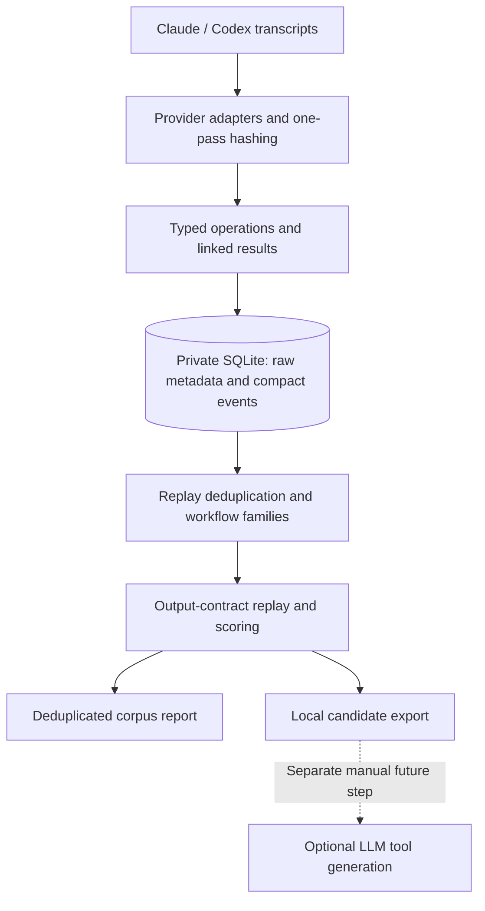

# Transcript Tool Miner

Find repeated Claude Code and Codex workflows and estimate where deterministic tools could reduce token consumption.

`ttm` is a local Python CLI with SQLite storage and no runtime dependencies. It parses transcripts, identifies workflow families and output-reduction opportunities, and produces a report of **counterfactual tool-output savings**. It does not execute transcript commands, call models, generate tools or install tools.

## Quick start

Requires Python 3.10 or newer. Installation may download the Python build dependency; analysis needs no network.

```sh
git clone https://github.com/matthewcosier/transcript-tool-miner.git
cd transcript-tool-miner
python3 -m venv .venv
. .venv/bin/activate
python -m pip install -e .

# Use the invented fixtures and a separate demo database.
ttm scan tests/fixtures --db .ttm/demo.sqlite3
ttm analyse --db .ttm/demo.sqlite3
ttm candidates --db .ttm/demo.sqlite3
ttm report --db .ttm/demo.sqlite3
```

The four synthetic sessions contain `run_tests → git_status → git_diff_check`. They demonstrate validation reporting and successful-output summarisation. The report assigns overlapping reductions only once.

For real history, leave the files where they are:

```sh
ttm scan /path/to/session-one.jsonl /path/to/session-two.jsonl
ttm analyse
ttm candidates
ttm report
```

The default database is **outside the checkout**, at `~/.local/state/transcript-tool-miner/miner.sqlite3`. `XDG_STATE_HOME` changes the state-directory root; `TTM_DB` or `--db` selects an explicit database. Do not use the demo database for real history.

## CLI

```sh
ttm scan                         # Discover both providers' standard directories
ttm scan --claude
ttm scan --codex
ttm scan /path/to/transcripts --workers 4 --json
ttm scan /path/to/transcripts --source codex
ttm scan /path/to/transcripts --matchers matchers.json

ttm analyse                      # Default support: 2 occurrences in 2 sessions
ttm analyse --min-occurrences 5 --min-sessions 3
ttm analyse --min-length 3 --max-length 6
ttm analyse --result-budget 300
ttm analyse --include-exploratory # Also show families with zero replay-supported reductions
ttm analyse --model-usage         # Optional separate audit of recorded API usage

ttm candidates --limit 10
ttm candidates --json
ttm candidate show <id>
ttm candidate export <id> --format json --output /private/output/candidate.json

ttm report --format json
ttm report --output /private/output/corpus-report.md
```

`--db` works before or after the subcommand. `analyse` also accepts `analyze`. Explicit input paths override home discovery. `CLAUDE_CONFIG_DIR` and `CODEX_HOME` override source roots. `--workers` accepts 1–8; the default is 1. Reports and exports refuse to overwrite existing files.

## What the report means

The headline answers:

> How many observed tool-output tokens could have been avoided if these output contracts had been used, without fetching the omitted content again?

It shows observed output, modelled output with the proposed tools, estimated reduction, and each proposed tool's contribution. Contributions are deduplicated by original action and reduction mechanism. Individual candidate estimates can overlap and must not be added together.

Three mechanisms receive credit:

1. **Successful validation summaries.** Keep status, recognised diagnostic lines with surrounding context, and the final 12 nonempty output lines. Retain full logs for retrieval. Failed, incomplete, visibly conflicting or ambiguously attributed results are not summarised.
2. **Empty process polling.** Omit empty intermediate polls only when the process is linked and its completion is observed. Preserve its terminal output and errors.
3. **Identical-result reuse.** After a fresh read, reference a retained, byte-identical result for the same operation. Matching is restricted to the same request, within five model turns, and reset by observed compaction. Changed content receives no credit. No source content is summarised.

The validation/polling scenario and the retained-result scenario are shown separately. Later retrieval reduces the realised benefit.

Token estimates use `ceil(characters / 4)`, not a provider tokenizer. **These are conditional output reductions, not measured billing savings.** They do not price tool definitions, changed model behaviour or repeated context replay.

### Optional model-call scenario

`ttm analyse --model-usage` examines recorded provider usage on narrowly eligible calls: tool-only turns in exact repeated successful validation plans, or empty polls of processes whose completion was observed. The initial model call, commentary and unrelated sibling tool calls are excluded. Inconsistent usage counters are not credited.

It separates cached, cache-write, uncached input and output tokens. It may reread relevant source files when usage metadata has not been stored. Changed or unavailable source snapshots are skipped during enrichment.

This is **gross historical usage on potentially removable calls**, not measured net savings. It is a separate scenario and must not be added to output reductions because they overlap.

## Pattern matching and ranking

The miner streams compact action records, rather than loading raw transcript arguments for the whole corpus.

- Literal tool calls inside supported JavaScript wrappers are extracted statically. Dynamic arguments, executable control flow around tool calls and unfamiliar helpers remain opaque.
- Simple shell command sequences retain their arguments, working directory and operation variants. For example, patch output, filename lists, statistics and `git diff --check` remain distinct.
- New requests, unknown operations, mutations and content-reading steps break workflow episodes. Linked process polling can be folded into its originating action.
- Workflow candidates require multiple model turns and distinct operations. Already-batched calls do not qualify as a model-turn opportunity, though their results may independently qualify for a reducer.
- Build/test/status variants are grouped into families, instead of presenting many overlapping subsequences as separate tools. Workflow episodes use 2–10 operations; standalone reducers and reuse opportunities can cover one repeated action.
- Replayed calls are excluded using provider, call identity and command. Resolvable Git worktrees share a repository identity. Unresolved working directories are reported separately from verified repositories.

The score is:

```text
eligible occurrences
× average replayed output reduction
× fraction of occurrences whose parameterised interface recurs across sessions
```

The report exposes these components. Interface recurrence is not proof that choosing arguments or test scope is deterministic. Candidates include observed variants, outcomes, a proposed boundary and up to three representative sessions.

## Architecture



Supported formats include Claude Code `assistant`/`user` tool-use records; Codex rollout metadata, response items, custom/function calls and outputs; and older Codex `{session, items}` JSON files. JSON arrays and `messages`/`items` containers are also supported. Prompt-only indexes contain no workflows and are cached as unsupported inputs.

Tool-output and reasoning bodies are measured but not persisted. Original commands, arguments, request snippets, source references and compact event metadata are retained locally.

## Incremental scans and database upgrades

An unchanged size, nanosecond modification time and parser/matcher version skips a source, including unsupported indexes and duplicate files. Changed sources are parsed and hashed in the same read. Action replacement and invalidation of derived reports occur transactionally. Files changing during reading are deferred; a malformed replacement retains its previous import.

Ingestion is incremental **per file**, not per append offset. Analysis rebuilds derived results using compact rows and SQLite temporary tables. Parse-worker submission and command caches are bounded, but each worker still holds a session's actions until results have been linked. Extremely large individual files can therefore require substantial memory.

Existing v1 databases are upgraded without deleting their raw action records. Rescan their source paths before analysing; older action metadata cannot support the new accounting. Parser-version changes also require rescanning. Deleted or moved source files remain historical observations; use a fresh database to rebuild from a different source set.

## Custom matchers

A trusted local JSON file can add shell command classification rules:

```json
[
  {"action": "run_tests", "pattern": "^make check$"},
  {"action": "find_related_files", "pattern": "^my-file-finder\\b"}
]
```

Rescan after changing matcher configuration. Novel labels do not automatically acquire a supported reduction contract or workflow family. Classification alone is not evidence of savings.

## Privacy

**Do not copy real transcripts into this repository.** Pass paths to their existing locations and keep databases and exports outside Git.

- No telemetry, model integration, network access or transcript-command execution is part of the CLI.
- JSONL files, rotated/case-variant JSONL logs, legacy rollout JSON, databases and common private output directories are Git-ignored.
- All checked-in fixtures are invented and explicitly labelled synthetic. Tests use isolated temporary sources and never scan your actual home history.
- A pre-commit guard and CI reject tracked transcript files and common private artifacts, even when force-added. Enable the hook in each clone with `git config core.hooksPath .githooks`.
- Databases and exports use owner-only file permissions on POSIX. Databases are **not encrypted** and may contain secrets in commands, arguments or request snippets. Database paths that point to symlinks or existing non-SQLite files are rejected.
- Candidate exports anonymise identifiers and paths, redact common credential formats, and truncate example commands. Redaction is best effort: inspect exports before sharing them. `--include-sensitive` deliberately retains original identifiers and commands for local review.
- Ignore rules and guards are safeguards, not a guarantee that renamed files or unfamiliar secrets can be detected.

## Development

```sh
python -m pip install -e .
python -m unittest discover -s tests -v
python scripts/check_public_tree.py
```

The suite covers parsing, wrapper safety, request/mutation boundaries, family grouping, polling, exact-result reuse, counterfactual accounting, recorded-usage checks, incremental rescans, database migration, exports, privacy protection and CLI integration. CI runs on Python 3.10, 3.12 and 3.14.

`python tests/make_fixtures.py` regenerates the invented fixtures from constants. See [verification notes](docs/verification.md) for the scope of the checks.

## Limitations

The supported workflow families and reducers are intentionally narrow. This is not general semantic workflow discovery. Dynamic JavaScript, complex shell constructs, implicit dependencies and unfamiliar tool protocols may remain unknown. Model-turn and outcome reconstruction depends on the recorded format; deduplication is a heuristic, not complete fork reconstruction.

A useful candidate still needs a reviewed interface, implementation and a real before/after evaluation. There are no embeddings, vector databases, local models or autonomous tool creation.

MIT licensed.
